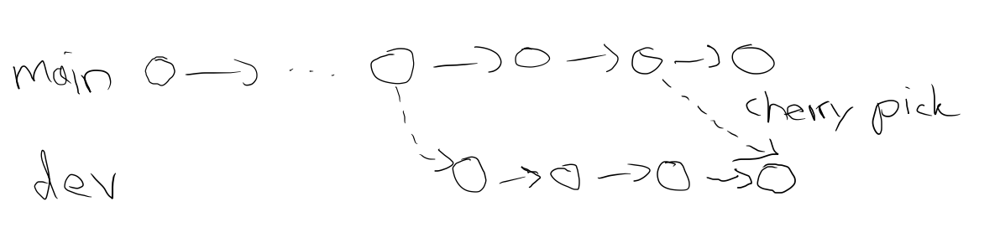

# cherry-search
A simple library for finding cherry-picks in git repositories. 

## Overview
With cherry-picking, it is possible to apply the changes that happened in a previous commit to the current commit. The commit that is cherry-picked is called the cherry. The cherry is usually located in another branch (source branch) and contains changes that are required in the current branch (target branch). 



The goal of cherry-picking - as opposed to merging - is to only apply a subset of the changes that happened on the source branch. 
In git, cherry-picking can be done with the [command line call](https://git-scm.com/docs/git-cherry-pick):
```
git cherry-pick <commit>
```

For some of our research topics it might be interesting to analyze how cherry-picking is used in practice. Currently, we have a Bachelor's thesis that is looking into cherry-picking in practice, and that is facing an unresolved challenge: git does not track cherry-picks explicitly.
This means, that there is no built-in mechanism to find all cherry-picks in a project. 

The goal of this library is to offer the necessary functionality to address this challenge. 

## Purposes
- Library that finds cherry-picks for a given set of repositories
- Repositories can be specified by a file path or URL

### Later Extension
- Introduce some kind of similarity-based search (not only exact matches)
  - This could be achieved through similarity-based hashing